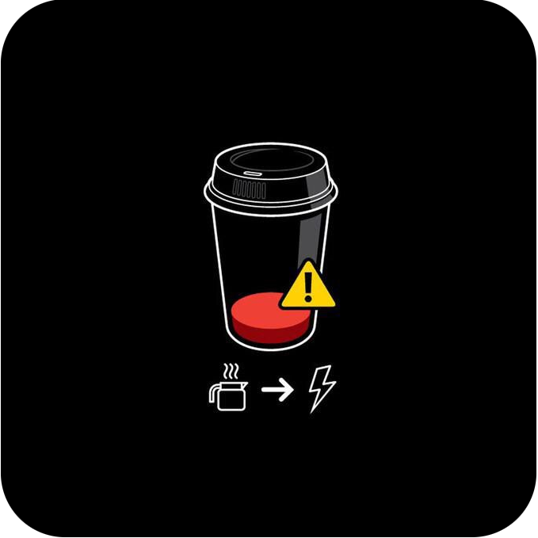

###  Olá! Eu sou Wesley Silva

  📜Sou estudante de Análise e Desenvolvimento de Sistemas na instituição Toledo Prudente, entusiasta da programação buscando adquirir conhecimento e experiencia na area.

  📚 Atualmente estou estudando TypeScript, React e Node

  🔎 Procurando por novas oportunidades...

  ⚡ Após desistir do curso engenharia civil por sentir que não estava no caminho do que eu amava fazer, fiquei um tempo trabalhando e refletindo sobre minha possível futura carreira, porem, no ano de 2021 voltei a estudar por conta programação web, e como o sentimento de amor só aumentou por essa área, resolvi cursar Analise e Desenvolvimento de Sistemas.

 

  
  
  
  
  
  
  

<h3 align="center">
  Redes 👤
</h3>

  
  
  
  
  

 

